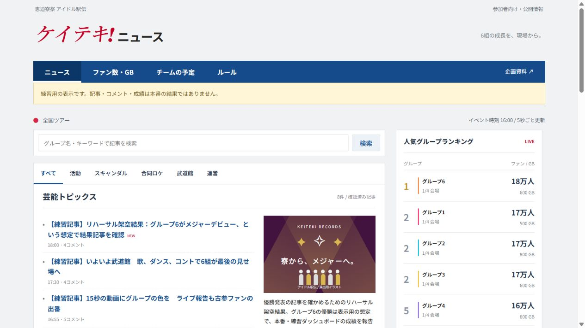

# 参加者・運営ページの使い分け

## 配るURL

- 参加者：https://idol-ekiden-control.coolmyna3.chatgpt.site
- 運営：https://idol-ekiden-control.coolmyna3.chatgpt.site/admin
- 練習記事：https://idol-ekiden-control.coolmyna3.chatgpt.site/demo
- リハーサル成績：https://idol-ekiden-control.coolmyna3.chatgpt.site/rehearsal

参加者ページ・公開記事はログイン不要。参加者の画面には入力・採点・編集・台帳・スタッフIDを表示しない。運営画面はログインに加え、サーバーで運営権限を確認する。

## 初回設定

サイト所有者のアカウントで `/admin` にログインし「所有者として運営を開始」を押す。初回登録は、Sites側で秘密設定した所有者のメールと一致するアカウントだけに許可する。誰でも最初の登録者になれる構成にはしない。登録済みの運営権限は引き継ぐ。登録後、初回受付 `ALLOW_OWNER_BOOTSTRAP` を無効にする。

スタッフは自分のアカウントでログインし、表示されたサイト内ユーザーIDを管理者に伝える。管理者が「台帳・設定」で追加する。編集者は記録・記事編集ができ、スタッフ追加と台帳復元は管理者のみ。

## 記事を出す

活動を記録 →「記事の編集」→原稿を選ぶ→要約・本文・架空コメントを確認→公開。任意の手書き記事も追加できる。挿絵は演出用のオリジナル図版。Yahoo!ニュースの情報配置を参考にした独自の「ケイテキ!ニュース」であり、実際のYahoo!記事ではない。

公開した記事の「LINE用の見出し＋URL」をコピーし、森本が全体LINEへ投稿する。URLは改稿後も同じ。プレビューは保存済み原稿の表示なので、編集後は保存してから確認する。「下書き保存・公開停止」は公開済み記事も読めなくする。誤公開時に使い、改稿後は再び確認して公開する。

予告はチーム限定。確認して「チーム用リンク発行」し、対象のチームLINEだけに貼る。公開一覧・検索に表示しない。推測困難な鍵付きリンクだが、リンクを転送された相手は読むことができるため、対象チーム内で扱う。停止すると以前の共有URLでも閲覧できない。

16:50の「スキャンダル結果公開」操作でファン増減を反映し、6組それぞれの結果原稿を作成する。原稿の公開ボタンを確認して押し、各記事URLを全体LINEへ。もみ消しの原稿は疑惑の詳細を含めず、掲載見送りを伝える。

## 同時編集・通信断

記事は記事ごとの版、採点台帳は台帳の版で競合を判定する。別担当が原稿を編集した場合、古い版での上書きを拒否し、入力中の文章を画面に残す。原稿を控えて保存済み版を読み直し、調整する。運営は定期的に台帳JSONを書き出す。通信断では紙台帳で受付し、復旧後に重複を確認して入力する。

コメントと反応数はすべて架空。応援・考察・活動への辛口ツッコミを混ぜる。実際の人物の容姿・属性や私生活の噂に向けない。コメントは報酬や得点を決めない。LINE・AIの有料APIには接続していない。

## 本番前の確認

所有者ログイン、スタッフ追加、スマホ2台以上の同期、LINEに貼った記事の開き方と見出し表示、チーム限定リンクの扱い、会場通信、紙台帳からの復旧を通しで試す。端末内の権限試験と、現地での実運用は区別する。

## 公開版の確認画像

[スマホの個別記事・コメント欄](assets/news-article-mobile.png)
